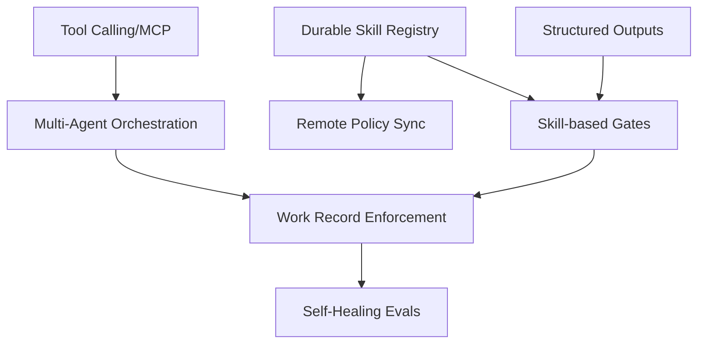

# Feature Landscape

**Domain:** Reproducible AI Engineering Frameworks
**Researched:** 2025-03-24
**Overall confidence:** HIGH

## Table Stakes

Features users expect in any modern AI-collaborative framework. Missing these makes the product feel incomplete or unusable for professional engineering.

| Feature | Why Expected | Complexity | Notes |
|---------|--------------|------------|-------|
| **Tool Calling / MCP** | Agents must interact with the world (Git, CLI, APIs). | Medium | Support for Model Context Protocol (MCP) is becoming the 2025 standard. |
| **Multi-Agent Orchestration** | Complex tasks require role-based decomposition (e.g., Researcher vs. Coder). | Medium | Frameworks like CrewAI and LangGraph have set this baseline. |
| **Human-in-the-Loop (HITL)** | Critical actions (deploys, deletes) require manual approval. | Low | Essential for trust and safety in engineering workflows. |
| **Stateful Context Mgmt** | Agents must remember previous steps without "forgetting" or losing context. | Medium | Requires persistent thread/session management. |
| **Structured Outputs** | AI must return JSON/Pydantic models for programmatic consumption. | Low | Necessary for integration with existing scripts and gates. |
| **Retrieval (RAG)** | Ability to "read" the codebase and documentation. | Medium | Must support hybrid search (vector + keyword) to be useful for code. |

## Differentiators

Features that set ReproGate apart or represent the "next wave" of AI engineering rigor.

| Feature | Value Proposition | Complexity | Notes |
|---------|-------------------|------------|-------|
| **Mandatory Record Enforcement** | Forces AI to document ADRs/RFCs *before* implementation. | Medium | Unique to ReproGate's "artifact-driven" approach. |
| **OPA/Rego Skill Gates** | Policy-as-code for AI behaviors. Auditable and standard-based. | High | Moves from "vibe checks" to formal verification of engineering standards. |
| **Durable Skill Registry** | Teams can share and version "Skills" (YAML/Rego) across projects. | Medium | Enables team scaling and standard synchronization. |
| **Artifact-Driven State** | State is stored in the repo (Git) rather than a hidden database. | Low | High reproducibility; if you have the repo, you have the state. |
| **Self-Healing Evals** | Automated "judge" agents that audit work against the Skill registry. | High | Reduces human reviewer fatigue by pre-filtering "slop". |
| **Remote Policy Sync** | Centralized management of engineering standards for large teams. | Medium | Critical for SCALE-01; keeps distributed teams in sync. |

## Anti-Features

Features to explicitly NOT build to maintain engineering rigor and avoid common pitfalls.

| Anti-Feature | Why Avoid | What to Do Instead |
|--------------|-----------|-------------------|
| **Opaque Abstractions** | "Black box" agents are impossible to debug when they fail. | Provide raw trace visibility and direct API access options. |
| **Infinite Agent Loops** | Causes "agentic runaway" and high token costs. | Implement strict `max_turns` and `token_budget` guardrails. |
| **Vector-Only Search** | Naive RAG misses exact technical terms (e.g., "INIT-01"). | Use Hybrid Search (Vector + Keyword/BM25). |
| **Heavy Server State** | Makes the framework hard to "port" and reduces reproducibility. | Prioritize local artifacts and Git-based state (STATE-01). |
| **Deterministic Delusion** | Expecting 100% LLM accuracy leads to brittle systems. | Design for probabilistic outcomes with validation gates. |

## Feature Dependencies

## MVP Recommendation

Prioritize:
1. **Skill-based Gates (OPA/Rego):** The core differentiator for engineering rigor.
2. **Mandatory Record Enforcement:** Implementation of the "artifact-driven" philosophy.
3. **Structured Outputs & Tool Calling:** Necessary for the framework to actually *do* work.
4. **Local Artifact State:** Ensures immediate portability and reproducibility.

Defer:
- **Remote Policy Sync:** Solve for a single team/project first.
- **Complex Multi-Agent Orchestration:** Focus on a single reliable "Engineer" agent first.
- **Self-Healing Evals:** High complexity; start with human-in-the-loop gates.

## Sources

- [ISO/IEC 42001 (AI Management System)](https://www.iso.org/standard/81230.html)
- [NIST AI Risk Management Framework 1.0](https://www.nist.gov/itl/ai-risk-management-framework)
- [Model Context Protocol (MCP) - Anthropic](https://modelcontextprotocol.io)
- [LangGraph Documentation - Stateful Orchestration](https://langchain-ai.github.io/langgraph/)
- [PydanticAI - Type-safe AI Framework](https://ai.pydantic.dev/)
