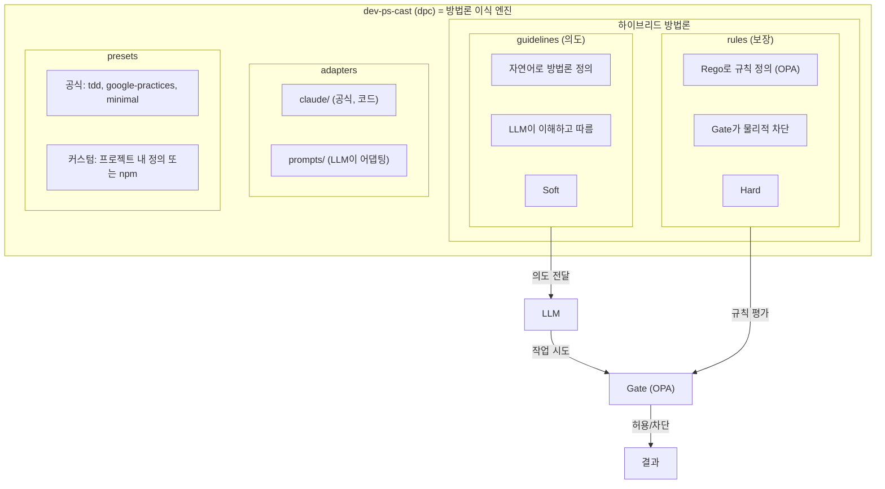

# dev-ps-cast (dpc) 아키텍처

> **슬로건**: "dev-ps-cast는 개발 방법론을 LLM에게 이식해, LLM이 당신처럼 일하게 만든다"

---

## 1. 핵심 정체성

```
dev-ps-cast = 개발(dev) 프로세스(ps)를 캐스팅(cast)한다
            = 방법론 이식 엔진
            = guidelines(의도) + rules(보장)의 하이브리드
```

| 항목 | 설명 |
|------|------|
| **타겟** | 바이브코딩 (AI 도구로 코딩하는 개발자) |
| **목적** | LLM을 내 분신처럼 동작하게 만듦 |
| **방식** | 개발 프로세스/방법론을 LLM에게 이식 |

---

## 2. 배포 방식

```bash
# 설치
npm install -g dev-ps-cast

# 사용
dpc init
dpc generate
dpc check
```

---

## 3. 패키지 구조

```
dev-ps-cast/                         # npm 패키지
│
├── cli/                             # CLI 명령어
│   ├── init                         # .dpc/ 생성
│   ├── generate                     # 어댑터 생성
│   └── check                        # 규칙 검증
│
├── core/                            # 이식 엔진
│   ├── gate-engine/                 # OPA/Rego 규칙 평가 (opa eval)
│   ├── template-engine/             # 문서 자동 생성
│   └── context-engine/              # 컨텍스트 유지
│
├── presets/                         # 공식 프리셋
│   ├── tdd/
│   │   ├── guidelines.md            # TDD 방법론 설명
│   │   └── rules.rego               # TDD 강제 규칙 (OPA/Rego)
│   ├── google-practices/
│   ├── adr-driven/
│   └── minimal/
│
├── adapters/                        # 도구 어댑터
│   ├── claude/                      # 공식: 코드 기반
│   │   ├── settings.json
│   │   └── hooks/pretooluse.js
│   │
│   └── prompts/                     # 프롬프트 기반 (다른 도구용)
│       ├── universal.md             # 범용 어댑팅 가이드
│       └── hints/
│           ├── kiro.md
│           ├── cursor.md
│           └── codex.md
│
└── guides/                          # 사용 가이드 (LLM 도우미)
    ├── methodology-setup.md         # 방법론 정의 도우미
    ├── preset-selection.md          # 프리셋 선택 도우미
    └── rules-writing.md             # 규칙 작성 도우미
```

---

## 4. 사용자 프로젝트 구조

```
my-project/                          # 사용자 프로젝트
│
├── .dpc/
│   ├── config.yaml                  # 메인 설정
│   ├── methodology/                 # 커스텀 방법론 (선택)
│   │   ├── guidelines.md            # 방법론 정의 (의도)
│   │   └── rules.rego               # 강제 규칙 - OPA/Rego (보장)
│   └── context/                     # 런타임 상태
│
├── .claude/                         # Claude 어댑터 (generate로 생성)
│   ├── settings.json
│   └── hooks/
│
├── src/
└── ...
```

---

## 5. 하이브리드 방법론 구조

### 개념

| 레이어 | 역할 | 누가 해석 | 강제 수준 |
|--------|------|----------|----------|
| `guidelines` | 방법론 정의 (의도) | LLM | Soft |
| `rules` | 준수 강제 (보장) | Gate 엔진 | Hard |

### 설정 예시

```yaml
# .dpc/config.yaml

# 옵션 A: 프리셋 사용
preset: "tdd"

# 옵션 B: 프리셋 + 오버라이드
preset: "tdd"
override:
  guidelines: |
    TDD 따르되, 유틸 함수는 테스트 생략 허용.

# 옵션 C: 완전 커스텀
methodology:
  guidelines: |
    테스트 먼저 작성하고 구현해.
    문서는 README만 관리하고, ADR은 필요 없어.
    커밋 메시지는 conventional commits 형식.

  rules: |
    # rules.rego (OPA/Rego)
    package dpc.rules
    import rego.v1

    deny contains msg if {
        input.trigger == "write"
        regex.match(`src/.*\.py$`, input.file)
        not file_exists(test_file_for(input.file))
        msg := "테스트 파일이 필요합니다"
    }

# 옵션 D: 조직 공유 프리셋
preset: "@mycompany/our-methodology"
```

### 흐름

```
guidelines: "TDD 따르고 싶어"
                ↓
         LLM이 이해하고 TDD 방식으로 작업
                ↓
rules: "테스트 없으면 차단"
                ↓
         혹시 안 따르면 Gate가 막음
```

**guidelines = 의도**, **rules = 보장**

---

## 6. 어댑터 전략

| 도구 | 지원 방식 | 상세 |
|------|----------|------|
| **Claude Code** | 공식: 코드 기반 | Hook이 rules 강제 |
| **Kiro, Cursor 등** | 프롬프트 기반 | LLM이 해당 도구 문서 보고 어댑팅 |

### 흐름

```
dpc generate 실행 시:

Claude → .claude/hooks/ 생성 (코드)
Kiro   → LLM이 adapters/prompts/ 참조 → Kiro용 설정 생성
```

---

## 7. 공유 방식

| 범위 | 방법 |
|------|------|
| **팀** | `.dpc/` 디렉토리 커밋 |
| **조직** | npm 패키지 (`@company/dpc-preset`) |
| **커뮤니티** | 공개 npm (`dpc-preset-tdd`) |

---

## 8. 사용 흐름

```bash
# 1. 설치
npm install -g dev-ps-cast

# 2. 초기화 (LLM 도우미와 대화하며 설정 가능)
cd my-project
dpc init

# 3. 방법론 선택/정의
#    - 프리셋 선택, 또는
#    - guidelines + rules 직접 작성, 또는
#    - LLM과 대화하며 정의

# 4. 어댑터 생성
dpc generate

# 5. 개발 시작
claude  # guidelines 따르고, rules가 강제
```

---

## 9. 요약


