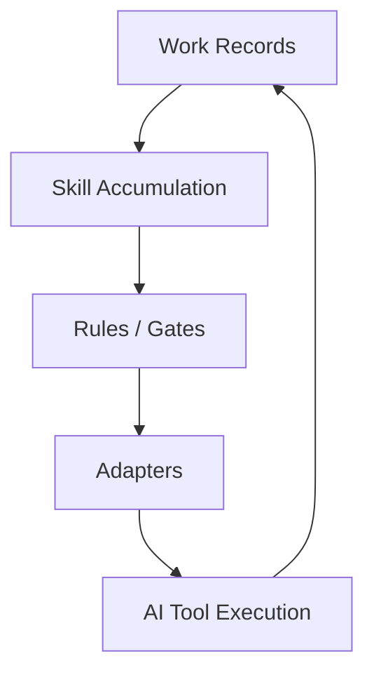

# ReproGate 아키텍처

> Canonical Definition: [final-definition.md](../strategy/final-definition.md)
> Tagline: **AI 협업을 대화 기반 감각 작업에서 재현 가능한 엔지니어링 체계로**

---

## 1. 핵심 정체성

ReproGate는 무거운 상태 추적 오케스트레이터가 아니다.

ReproGate는 다음 네 요소로 구성되는 **artifact-driven compiler / gatekeeper**다.

1. **작업 기록**
   - 의도, 범위, 결정, 완료조건, 검증 근거를 남기는 공학적 기록
2. **Skills**
   - 반복되는 작업 패턴을 텍스트 자산으로 누적한 단위
3. **Rules / Gates**
   - 기록과 산출물을 검사하여 누락/이탈을 물리적으로 차단하는 강제층
4. **Adapters**
   - 각 AI 도구가 같은 기록과 규칙을 읽고 실행하도록 연결하는 표면

핵심 인과는 다음과 같다.

```text
작업 기록 → 반복 패턴 발견 → Skill 축적 → Rule/Gate 강제
```

즉, ReproGate는 **기억에 의존하는 작업을 기록 위의 작업으로 바꾸고**, 그 기록을 바탕으로 패턴을 누적하고 강제한다.

---

## 2. 아키텍처 원칙

### 2.1 Record-first
강제 가능한 작업은 기록 가능한 작업이어야 한다.
대화 맥락이나 런타임 상태만으로는 규칙을 안정적으로 집행할 수 없다.

### 2.2 Skill accumulation
좋은 패턴은 휘발성 프롬프트가 아니라 재사용 가능한 Skill로 승격되어야 한다.

### 2.3 Gate enforcement
Rules는 기록과 산출물을 검사하고, 필요한 증거가 없으면 차단한다.

### 2.4 Artifact-driven workflow
“지금 몇 단계인가”보다 “필수 산출물이 존재하는가”가 다음 행동을 결정한다.

### 2.5 Team portability
개인이 다듬은 패턴은 저장소에 커밋되어 팀 표준으로 확장될 수 있어야 한다.

---

## 3. 시스템 구조

```text
reprogate/
├── strategy/                 # 제품 정체성, 비전, 로드맵
├── governance/               # 저장소 운영 원칙, master plan, record spec
├── design/                   # 설계 문서
├── scripts/                  # bootstrap / validation / helper scripts
├── config/                   # config schema and defaults
├── templates/                # adapter / record / bootstrap templates
└── adapters/                 # 도구 연결 표면(개념적)
```

> 현재 저장소에는 legacy `dpc` 명칭, 경로, CLI 예시가 남아 있을 수 있다.  
> 이는 점진적으로 ReproGate 정체성에 맞춰 정렬한다.

---

## 4. 사용자 프로젝트 구조

```text
my-project/
├── .reprogate/               # 제품 설정 및 구조적 정의체 (Layer 2)
│   ├── config.yaml
│   ├── methodology/
│   │   ├── guidelines.md
│   │   └── rules.rego
│   ├── presets/
│   └── context/              # runtime support
├── records/                  # 작업 기록 / 설계 / 의사결정 / 변경 기록 (Layer 1 Core 증거)
├── .claude/                  # Integration 표면 (Layer 3)
├── .codex/                   # Integration 표면 (Layer 3)
└── src/
```

중요한 구분 (3층 바운더리 기준):

- `.reprogate/context/` 같은 런타임 상태는 **재개용 보조 정보**
- `records/` 구조의 작업 기록은 **판단과 강제를 위한 불변 증거 (Core)**
- 저장 위치 자체는 사용자가 커스텀 가능 (Storage Agnosticism)

---

## 5. 핵심 객체 모델

### 5.1 Work Records

ReproGate가 강제를 위해 필요로 하는 핵심 증거 모델.

예:
- 작업 계획 기록
- 의사결정 기록
- 설계 기록
- 변경 기록
- 검증 기록

### 5.2 Skill

하나의 재사용 가능한 작업 패턴 단위.

구성:
- `guidelines.md` — 의도, 원칙, 기대 행동
- `rules.rego` — 강제 조건

### 5.3 Preset / Workflow

특정 작업 유형에서 함께 적용할 Skill 묶음.

예:
- 신규 기능 개발
- 버그 수정
- 리팩토링
- 설계 변경

### 5.4 Gate

Rules를 평가하는 집행 계층.

Gate는 다음을 본다:
- 지금 어떤 작업이 시도되는가
- 관련 기록이 존재하는가
- 필수 산출물이 충족되었는가
- 누락된 증거가 있는가

---

## 6. 논리 흐름

```text
사용자/팀이 AI와 작업
    ↓
작업의 의도/결정/검증이 기록으로 남음
    ↓
반복되는 좋은 패턴을 Skill로 승격
    ↓
rules.rego가 그 패턴을 검사 가능하게 만듦
    ↓
Gate가 다음 작업/커밋/변경을 허용 또는 차단
```

결과:
- 기억 의존 작업 감소
- 누락된 보조 작업 감소
- 설명 가능한 의사결정 증가
- 팀 간 결과물 편차 감소

---

## 7. Artifact-Driven Workflow 예시

```text
자유 대화로 구현 시작 (Freeform-first)
  → 작업 중 설계/결정 내림
  → 나중에 기록/Skill로 승격 (Late Entry)
  
코드 작성 시도
  → 설계 기록 없음
  → Gate 차단 (재현성 결손 차단)

코드 수정 완료
  → 필수 워크플로 단계 생략 (Deviation Awareness)
  → 편차 기록 후, 검증 기록 등 필수 증거 확인 시 패스 가능
```

ReproGate는 내부적으로 규칙과 증거만 평가하지만,
밖에서 보면 **작업 순서가 억압 없이도 자연스럽게 재현 가능한 방향으로 유도되는 효과**를 만든다.

---

## 8. Adapter 전략

| 계층 | 역할 |
|---|---|
| 공식 adapter | 도구별 설정/훅/entrypoint 연결 |
| prompt adapter | 비공식 도구에 대한 힌트/생성 가이드 |
| record adapter | 저장소마다 기록 위치와 규칙 연결 |

Adapter의 책임은:
- 도구에 기록/규칙 표면을 연결하고
- 기록 기반 강제가 실행되도록 만들며
- 제품 철학을 특정 벤더 기능명에 종속시키지 않는 것이다.

---

## 9. 배포 / 실행 표면

현재 설계상 노출되는 핵심 표면은 다음과 같다.

```bash
reprogate init
reprogate generate
reprogate check
```

이 명령 표면의 의미는 다음과 같이 정의된다.

- `init` — 기록/Skill/Gate 적용을 위한 초기 구조 생성
- `generate` — adapter와 bootstrap surface 생성
- `check` — 기록과 규칙의 정합성 검증 (최소 불변 계약 기반)

---

## 10. 아키텍처 요약



핵심 요약:

- **기록은 증거**
- **Skill은 축적된 패턴**
- **Gate는 강제 메커니즘**
- **Adapter는 도구 연결 표면**
- **ReproGate는 기록 기반 엔지니어링을 만드는 compiler / gatekeeper**
