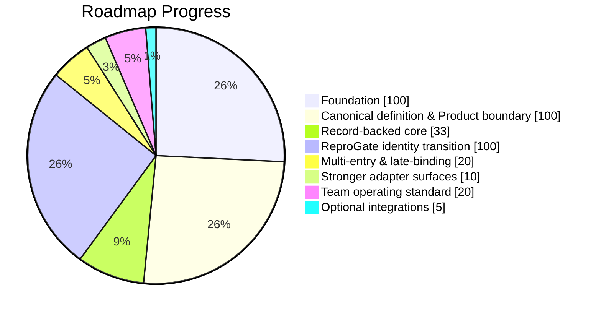

# ReproGate Progress Report

> Generated from roadmap + issue/PR/file state.
> Do not edit manually.

## Snapshot

- Overall: **48%** 🟡
- Status: **Drafted**
- Last updated: `2026-03-19T08:13:35.982564+00:00`

## Stage Board

| Area | Health | Status | Progress | Bar |
| ---- | :----: | ------ | -------: | --- |
| Foundation | 🟢 | Closed | 100% | `██████████` |
| Canonical definition & Product boundary | 🟢 | Closed | 100% | `██████████` |
| Record-backed core | 🔴 | Seeded | 33% | `███░░░░░░░` |
| ReproGate identity transition | 🟢 | Closed | 100% | `██████████` |
| Multi-entry & late-binding | 🔴 | Seeded | 20% | `██░░░░░░░░` |
| Stronger adapter surfaces | 🔴 | Seeded | 10% | `█░░░░░░░░░` |
| Team operating standard | 🔴 | Seeded | 20% | `██░░░░░░░░` |
| Optional integrations | 🔴 | Seeded | 5% | `░░░░░░░░░░` |
