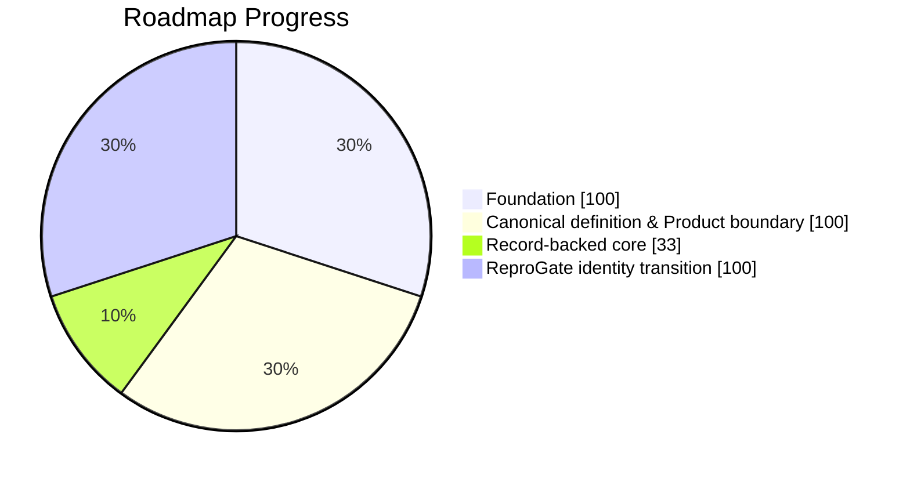

# ReproGate Progress Report

> Generated from roadmap + issue/PR/file state.
> Do not edit manually.

## Snapshot

- Overall: **79%**
- Status: **In progress**
- Last updated: `2026-03-19T01:45:59.482150+00:00`

## Stage Board

| Area | Status | Progress | Bar |
| ---- | ------ | -------: | --- |
| Foundation | Closed | 100% | `██████████` |
| Canonical definition & Product boundary | Closed | 100% | `██████████` |
| Record-backed core | Seeded | 33% | `███░░░░░░░` |
| ReproGate identity transition | Closed | 100% | `██████████` |
